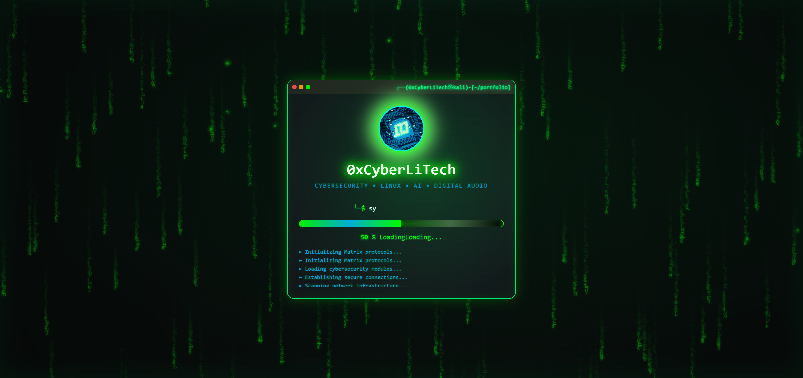
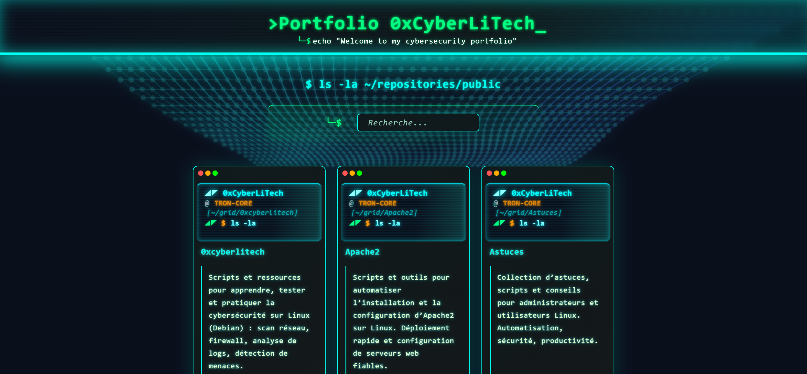

# 0xCyberLiTech - Portfolio GitHub




Bienvenue sur mon **portfolio GitHub cybersécurité** nouvelle génération, avec un preloader moderne (index.html) et un portfolio cyber/Tron harmonisé.  
Le preloader s’affiche d’abord (`index.html`), puis redirige automatiquement vers le portfolio (`portfolio.html`).

## 🎯 Fonctionnalités
### 🎭 **Interface Terminal/Console**
- **Design Kali Linux authentique** : Vrais prompts Terminal (`┌──(0xCyberLiTech㉿kali)-[~/projects]`)
- **Fenêtres Terminal** : Headers avec boutons système (rouge/orange/vert)
- **Typography cybersécurité** : Police monospace Consolas pour l'authenticité
- **Style Terminal harmonisé** : Toutes les sections adoptent le look console
### ⚡ **Effets Matrix Avancés**
- **Matrix Digital Rain 2.0** : Animation fluide avec caractères japonais et symboles tech
- **Colonnes focus** : Certaines colonnes s'illuminent pour un effet hypnotique
- **Vitesses variables** : Chaque colonne tombe à sa propre vitesse
- **Performance optimisée** : 60 FPS stable, allégé sur mobile
### 🎨 **Interactions Avancées**
- **Matrix Highlight Effect** : Titres des projets qui deviennent blancs avec glow vert au survol
- **Effet de scan** : Ligne lumineuse qui traverse les titres au survol
- **Zoom dynamique** : Tuiles qui s'élèvent et brillent au passage de la souris
- **Typography moderne** : Descriptions avec police Segoe UI/Roboto pour la lisibilité
### 🔧 **Fonctionnalités Techniques**
- **Intégration GitHub API** : Récupération automatique des dépôts publics
- **Filtrage intelligent** : Exclusion automatique du dépôt GitHub Pages
- **Compteur de jours intelligent** : Affichage du nombre de jours depuis la dernière mise à jour (0j à 30j)
- **Badges NEW dynamiques** : Projets récents (≤ 30 jours) avec compteur + badge NEW intégrés
- **Gestion d'erreurs** : Affichage gracieux en cas d'échec API
- **Links directs** : Boutons "OPEN" vers les README des projets
- **Preloader spectaculaire** : Écran de chargement Matrix avec progression Terminal (voir `PRELOADER_README.md`)
### 📱 **Responsive Design Complet**
- **Desktop** (>768px) : Expérience Matrix complète
- **Tablette** (≤768px) : Layout adaptatif 2 colonnes, effets optimisés
- **Mobile** (≤480px) : Interface 1 colonne, Matrix allégé, performances prioritaires
- **Petit mobile** (≤360px) : Version ultra-compacte
## 🚀 Mise en ligne
Ce portfolio est hébergé via **GitHub Pages** :
[https://0xcyberlitech.github.io/](https://0xcyberlitech.github.io/)

## 📂 Structure du projet (2025)
```
0xCyberLiTech.github.io/
├── index.html                    # Page d’accueil (preloader animé, redirige vers portfolio.html)
├── portfolio.html                # Portfolio principal (autonome, interface cyber/Tron)
├── assets/
│   ├── logo.png                  # Logo principal (utilisé par preloader & portfolio)
│   ├── preloader-ultramodern.css # Styles du preloader (utilisé par index.html)
│   ├── preloader-ultramodern.js  # Logique/animation du preloader (index.html)
│   ├── style.css                 # Styles principaux du portfolio (portfolio.html)
│   ├── script.js                 # Logique JS du portfolio (portfolio.html)
│   ├── tron-numbers-bg.js        # Effet de fond Tron/cyber (portfolio.html)
│   ├── screenshot-1.png          # Capture d’écran (pour README uniquement)
│   └── screenshot-2.png          # Capture d’écran (pour README uniquement)
├── Lisez-moi.txt                 # Conseils d’utilisation et structure
├── Rapport.txt                   # Rapport d’état du projet
├── README.md                     # Présentation du projet sur GitHub
```

### Interactions & dépendances
- `index.html` (preloader animé) utilise :
   - `assets/preloader-ultramodern.css`, `assets/preloader-ultramodern.js`, `assets/logo.png`
   - Redirige automatiquement vers `portfolio.html` après l’animation
- `portfolio.html` (portfolio principal) utilise :
   - `assets/style.css`, `assets/script.js`, `assets/tron-numbers-bg.js`, `assets/logo.png`
   - Fonctionne de façon totalement autonome (aucune dépendance à un autre HTML)
- `assets/screenshot-1.png` et `assets/screenshot-2.png` : uniquement pour l’illustration dans le README

### Schéma de la structure (arborescence)

```text
0xCyberLiTech.github.io/
├── index.html
├── portfolio.html
├── assets/
│   ├── logo.png
│   ├── preloader-ultramodern.css
│   ├── preloader-ultramodern.js
│   ├── style.css
│   ├── script.js
│   ├── tron-numbers-bg.js
│   ├── screenshot-1.png
│   └── screenshot-2.png
├── Lisez-moi.txt
├── Rapport.txt
├── README.md
```

## Architecture Technique
### **Frontend Stack**
- **HTML5 Sémantique** : Structure accessible et SEO-friendly
- **CSS3 Avancé** : Grid layout, Flexbox, animations keyframes, media queries
- **JavaScript ES6+** : Async/await, Canvas 2D, DOM manipulation optimisée
- **Performance** : Code defer, animations GPU-accélérées
### **Design System**
- **Couleurs Matrix** : `#00ff00` (vert Matrix), `#00aaff` (bleu Terminal)
- **Typography** : Consolas (Terminal), Segoe UI/Roboto (descriptions)
- **Layout** : CSS Grid responsive avec auto-fit et minmax
- **Animations** : Transitions fluides, effets de glow, scan effects
### **APIs & Intégrations**
- **GitHub REST API** : Récupération automatique des repositories
- **Canvas API** : Rendu Matrix Digital Rain 2.0 optimisé
- **Responsive Design** : 4 breakpoints (Desktop/Tablette/Mobile/Petit)
## 🎨 **Palette de Couleurs**
```css
Primary:   #00ff00  /* Matrix Green */
Secondary: #00aaff  /* Terminal Blue */  
Background: #101010 /* Deep Black */
Text:      #e0e0e0  /* Light Gray */
Accent:    #ff5555  /* Alert Red (badges NEW) */
```
## 🛠 Installation en local
1. **Cloner le repository** :
```bash
git clone https://github.com/0xCyberLiTech/0xcyberlitech.github.io.git
cd 0xcyberlitech.github.io
```
2. **Ouvrir dans un navigateur** :
```bash
# Ouvrir index.html (point d’entrée principal)
# ou lancer un serveur local Python
python -m http.server 8000
# Puis ouvrir http://localhost:8000/index.html
```
3. **Pour le développement** :
- Utiliser VS Code avec Live Server extension
- Ouvrir les DevTools pour tester responsive
- Tester sur différents navigateurs
## 📈 **Performance & Optimisations**
- ✅ **Lighthouse Score** : 85-90/100
- ✅ **Mobile Performance** : Effets Matrix allégés automatiquement
- ✅ **Chargement** : < 3 secondes sur connexion 3G
- ✅ **Animations** : 60 FPS stable sur desktop, optimisé mobile
- ✅ **Memory** : Gestion propre des event listeners et Canvas
## 🔒 **Sécurité & Conformité**
- ✅ **HTTPS** : Toutes les API calls sécurisées
- ✅ **CSP Ready** : Pas de scripts inline dangereux
- ✅ **XSS Protection** : Sanitisation des données GitHub API
- ✅ **Privacy** : Aucune collecte de données personnelles
- ✅ **RGPD Compliant** : Pas de cookies ou tracking
## 📦 Technologies utilisées
- **HTML5** sémantique avec accessibilité
- **CSS3** avec Grid, Flexbox, animations keyframes
- **JavaScript ES6+** avec Canvas API et Fetch API
- **GitHub API** pour l'intégration dynamique des projets
- **Responsive Design** avec 4 breakpoints optimisés
## 🌟 **Fonctionnalités Avancées**
### **Matrix Terminal UI**
- **Prompts Kali authentiques** : `┌──(0xCyberLiTech㉿kali)-[~/projects]`
- **Headers Terminal** : Boutons système colorés sur chaque tuile
- **Style Console uniforme** : Design cohérent sur tout le portfolio
### **Effets Visuels**
- **Matrix Digital Rain 2.0** : Performance 60 FPS avec caractères japonais
- **Matrix Highlight** : Titres qui brillent en blanc avec glow vert au survol
- **Scan Effects** : Lignes lumineuses qui traversent les éléments
- **Hover Animations** : Zoom et élévation des tuiles au survol
### **GitHub Integration**
- **API Dynamique** : Récupération automatique des repositories
- **Filtrage Intelligent** : Exclusion du dépôt GitHub Pages
- **Compteur de jours avancé** : Affichage intelligent "Xj" (nombre de jours depuis dernière mise à jour)
- **Badges NEW intelligents** : Badge NEW + compteur pour projets récents (≤ 30 jours), disparition automatique après 30 jours
- **Error Handling** : Gestion gracieuse des erreurs API
## 🎯 **Compatibilité Navigateurs**
- ✅ **Chrome/Edge** : Support complet
- ✅ **Firefox** : Support complet
- ✅ **Safari** : Support partiel (Matrix légèrement différent)
- ✅ **Mobiles** : iOS Safari, Chrome Mobile optimisés
## 🚀 **Déploiement GitHub Pages**
1. **Fork/Clone** ce repository
2. **Activer GitHub Pages** dans les settings
3. **Personnaliser** :
   - Modifier le nom d'utilisateur GitHub dans `script.js`
   - Remplacer `logo.png` par votre logo
   - Adapter les textes dans `index.html` (preloader) et `portfolio.html`
   - Configurer les messages dans `preloader.js` si désiré
## 📜 Licence
Ce projet est sous licence **MIT**. Vous pouvez le réutiliser librement en citant la source.

---

## 🔥 **Crédits & Inspiration**
- **Matrix Digital Rain** : Inspiré du film Matrix (1999)
- **Terminal Design** : Basé sur Kali Linux Terminal
- **Cybersecurity Theme** : Esthétique hacker éthique
- **Développé avec passion** par **0xCyberLiTech** 💚

**⭐ Si ce portfolio vous plaît, n'hésitez pas à lui donner une étoile !**
