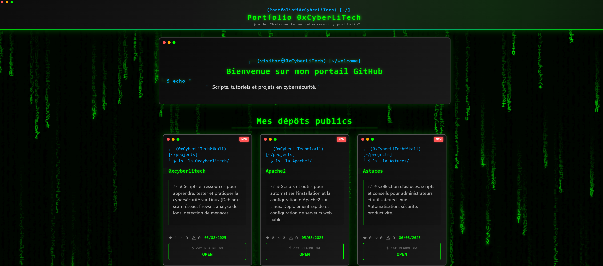

# 0xCyberLiTech - Portfolio GitHub



Bienvenue sur mon **portfolio GitHub**.  
Ce site présente mes projets, scripts et tutoriels en cybersécurité, avec un style inspiré de l'univers **Matrix**.

## 🎯 Fonctionnalités
- **Effet Matrix** animé et adaptatif plein écran.
- **Liste automatique de mes dépôts GitHub** (via l'API GitHub).
- **Effet machine à écrire** au survol des cartes projets.
- Badge **🆕 Nouveau** pour les projets récents.
- **Responsive design** compatible mobile et desktop.
- Optimisé pour **GitHub Pages** avec fichier `.nojekyll`.

## 🚀 Mise en ligne
Ce portfolio est hébergé via **GitHub Pages** :
[https://0xcyberlitech.github.io/](https://0xcyberlitech.github.io/)

## 📂 Structure
```
/
├── index.html         # Page principale
├── .nojekyll          # Désactive Jekyll sur GitHub Pages
├── assets/            # Styles, scripts et images
│   ├── style.css
│   ├── script.js
│   ├── logo.png
│   └── screenshot.png # Capture d'écran du site (à ajouter)
```

## 📦 Technologies utilisées
- **HTML5** / **CSS3** (animations & responsive)
- **JavaScript** (API GitHub, effets interactifs)
- **Google Fonts** (Orbitron)
- **Open Graph & Twitter Card** pour le partage sur réseaux sociaux

## 🛠 Installation en local
1. Télécharger ou cloner ce dépôt :
```bash
git clone https://github.com/0xCyberLiTech/0xcyberlitech.github.io.git
```
2. Ouvrir `index.html` dans un navigateur.

## 📜 Licence
Ce projet est sous licence MIT. Vous pouvez le réutiliser en citant la source.
