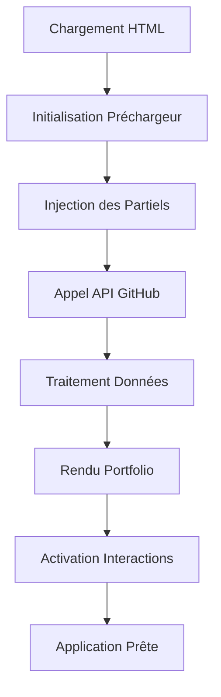

# 🏗️ Architecture du Portfolio 0xCyberLiTech

> **Version :** 2.1 — **Dernière mise à jour :** 27 décembre 2025  
> Ce document décrit l’architecture technique, l’organisation des fichiers et les flux de données du projet.

---

## 📑 Sommaire
- [🏗️ Architecture du Portfolio 0xCyberLiTech](#️-architecture-du-portfolio-0xcyberlitech)
  - [📑 Sommaire](#-sommaire)
  - [🗂️ Vue d’ensemble](#️-vue-densemble)
  - [🌳 Arborescence détaillée](#-arborescence-détaillée)
  - [🔄 Flux de données et interactions](#-flux-de-données-et-interactions)
  - [🧩 Optimisations et factorisation](#-optimisations-et-factorisation)
  - [🏗️ Architecture des modules](#️-architecture-des-modules)
    - [Préchargeur](#préchargeur)
    - [Portfolio](#portfolio)
    - [Utils](#utils)
  - [📚 Ressources utiles](#-ressources-utiles)

---

## 🗂️ Vue d’ensemble

Le portfolio utilise une architecture modulaire frontend-only basée sur des technologies web natives, sans framework externe.  
Principes : séparation des responsabilités, modularité, performance, accessibilité, code DRY.

---

## 🌳 Arborescence détaillée

```text
0xCyberLiTech.github.io/
│
├── index.html
├── portfolio.html
├── assets/
│   ├── logo/
│   ├── partials/
│   ├── portfolio/
│   ├── preloader/
│   └── utils/
├── build/
│   ├── build.cjs
│   └── MINIFICATION.md
├── docs/
│   ├── ARCHITECTURE.md
│   ├── API.md
│   ├── ...
├── package.json
├── package-lock.json
└── ...
```

---

## 🔄 Flux de données et interactions



---

## 🧩 Optimisations et factorisation

- Suppression des doublons CSS (animations centralisées)
- DOMCache pour chaque module
- Factorisation des utilitaires

---

## 🏗️ Architecture des modules

### Préchargeur
```text
PreloaderManager
├── Canvas Animation
├── Progress Tracking
├── Asset Loading Simulation
└── Transition to Portfolio
```

### Portfolio
```text
PortfolioManager
├── GitHub API Client
├── Repository Data Processor
├── UI Renderer
├── Event Handlers
└── Tron Background Effect
```

### Utils
```text
Utils
└── utilEscapeHTML (protection XSS)
```

---

## 📚 Ressources utiles

- [README.md](README.md) — Sommaire de la documentation
- [API.md](API.md) — Documentation des APIs
- [MINIFICATION.md](../build/MINIFICATION.md) — Minification automatique

---

**Auteur :** 0xCyberLiTech — 2025