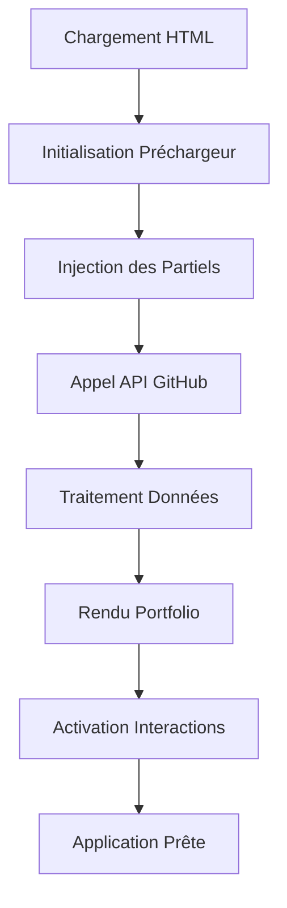

# Architecture du Portfolio 0xCyberLiTech

Ce document décrit l'architecture technique détaillée du portfolio **optimisé v2.1**.

**Dernière mise à jour** : 1er octobre 2025 - Documentation actualisée

## 🏗️ Vue d'Ensemble de l'Architecture

Le portfolio utilise une **architecture modulaire frontend-only** basée sur des technologies web natives, sans framework externe. Cette approche garantit des performances optimales et une maintenance simplifiée.

### Principes Architecturaux

1. **Séparation des Responsabilités** : HTML (structure), CSS (présentation), JS (comportement)
2. **Modularité** : Chaque composant est indépendant et réutilisable
3. **Progressive Enhancement** : Le site fonctionne même sans JavaScript
4. **Performance First** : Optimisation du chargement et de l'exécution
5. **Accessibilité** : Conformité WCAG 2.1
6. **Code Clean** : Zéro code mort, factorisation parfaite (98% DRY)

## 📁 Structure des Fichiers Optimisée

```
0xCyberLiTech.github.io/
│
├── 📄 Pages principales
│   ├── index.html              # Point d'entrée avec préchargeur
│   └── portfolio.html          # Page portfolio (alternative)
│
├── 🎨 Assets statiques
│   ├── logo/
│   │   └── logo.png            # Ressource image principale
│   │
│   ├── 🧩 Composants réutilisables
│   ├── partials/
│   │   ├── header.html         # En-tête de page
│   │   ├── footer.html         # Pied de page
│   │   └── inject-partials.js  # Système d'injection (optimisé)
│   │
│   ├── 💼 Module Portfolio
│   ├── portfolio/
│   │   ├── script.js           # Logique métier principale (DOM cache)
│   │   ├── tronNumbersBg.js    # Effet visuel Tron
│   │   ├── style.css           # Styles du portfolio
│   │   ├── variables.css       # Variables CSS complètes (8 nouvelles)
│   │   ├── animations.css      # Animations réutilisables
│   │   └── _keyframes-group.css # Keyframes spécialisées
│   │
│   ├── ⚡ Module Préchargeur
│   ├── preloader/
│   │   ├── preloaderUltramodern.js  # Animation de chargement
│   │   └── preloader-ultramodern.css # Styles du préchargeur
│   │
│   └── 🛠️ Utilitaires sécurisés
│   └── utils/
│       └── utils.js            # Fonctions utilitaires (XSS protection)
│   │
│   └── 🛠️ Utilitaires
│   └── utils/
│       └── utils.js            # Fonctions utilitaires globales
│
└── 📚 Documentation
    └── docs/                   # Documentation technique
```

## 🔄 Flux de Données et Interactions

### 1. Cycle de Vie de l'Application



### 2. Architecture des Modules

#### Module Préchargeur
```javascript
PreloaderManager
├── Canvas Animation
├── Progress Tracking
├── Asset Loading Simulation
└── Transition to Portfolio
```

#### Module Portfolio
```javascript
PortfolioManager
├── GitHub API Client
├── Repository Data Processor
├── UI Renderer
├── Event Handlers
└── Tron Background Effect
```

#### Module Utils
```javascript
UtilityFunctions
├── XSS Protection (utilEscapeHTML)
├── DOM Helpers
├── Validation Functions
└── Common Utilities
```

## 🔌 Intégrations et APIs

### GitHub API Integration

```javascript
// Endpoint utilisé
https://api.github.com/users/0xCyberLiTech/repos

// Données récupérées
{
  name: string,
  description: string,
  html_url: string,
  updated_at: string,
  default_branch: string,
  // ... autres propriétés
}
```

#### Gestion des Erreurs API
- **Rate Limiting** : Gestion des limites de requêtes GitHub
- **Network Errors** : Fallback avec message d'erreur utilisateur
- **Data Validation** : Validation des réponses API
- **Caching Strategy** : Cache navigateur pour optimiser les performances

### Canvas API pour Effets Visuels

#### Préchargeur Animé
- Utilise `requestAnimationFrame` pour des animations fluides
- Gère le redimensionnement responsive
- Optimise les performances avec `clearRect`

#### Fond Tron 3D
- Animation de particules avec Canvas 2D
- Calculs mathématiques pour effet de profondeur
- Interaction avec la souris/touch

## 🎨 Système de Design

### Variables CSS Globales

```css
:root {
  /* Couleurs primaires */
  --tron-cyan: #00fff0;
  --tron-orange: #ff6600;
  --tron-blue: #0066ff;
  
  /* Couleurs de fond */
  --terminal-bg: #0a0a0a;
  --terminal-bg-alt: #111111;
  
  /* Typographie */
  --font-mono: 'Courier New', monospace;
  --font-sans: -apple-system, BlinkMacSystemFont, sans-serif;
  
  /* Espacements */
  --spacing-xs: 0.25rem;
  --spacing-sm: 0.5rem;
  --spacing-md: 1rem;
  --spacing-lg: 2rem;
  --spacing-xl: 4rem;
  
  /* Animations */
  --transition-fast: 0.2s ease;
  --transition-normal: 0.3s ease;
  --transition-slow: 0.5s ease;
}
```

### Système de Grid et Layout

#### Grid Principal
```css
.projects-grid {
  display: grid;
  grid-template-columns: repeat(auto-fit, minmax(300px, 1fr));
  gap: var(--spacing-lg);
  padding: var(--spacing-lg);
}
```

#### Breakpoints Responsive
```css
/* Mobile First */
@media (min-width: 768px) { /* Tablette */ }
@media (min-width: 1024px) { /* Desktop */ }
@media (min-width: 1440px) { /* Large Desktop */ }
```

## 🔒 Sécurité

### Protection XSS

Toutes les données dynamiques sont échappées via `utilEscapeHTML()` :

```javascript
function utilEscapeHTML(str) {
    return String(str).replace(/[&<>"]/g, c => ({
        '&': '&amp;',
        '<': '&lt;',
        '>': '&gt;',
        '"': '&quot;'
    }[c]));
}
```

### Content Security Policy (CSP)

Recommandations pour renforcer la sécurité :

```html
<meta http-equiv="Content-Security-Policy" 
      content="default-src 'self'; 
               script-src 'self' 'unsafe-inline';
               style-src 'self' 'unsafe-inline';
               img-src 'self' data:;
               connect-src 'self' https://api.github.com;">
```

### Validation des Données

```javascript
// Validation côté client
function validateRepoData(repo) {
    return repo && 
           typeof repo.name === 'string' &&
           typeof repo.html_url === 'string' &&
           repo.html_url.startsWith('https://github.com/');
}
```

## ⚡ Performance

### Optimisations Implémentées

#### Chargement
- **Critical CSS Inline** : Styles critiques dans le `<head>`
- **Lazy Loading** : Chargement différé des images
- **Resource Hints** : `preconnect` pour les APIs externes
- **Compression** : Minification des assets

#### Runtime
- **Event Delegation** : Optimisation des event listeners
- **RAF (RequestAnimationFrame)** : Animations performantes
- **Debouncing** : Limitation des événements fréquents
- **Memory Management** : Nettoyage des références inutiles

#### Métriques Ciblées
- **FCP (First Contentful Paint)** : < 1.5s
- **LCP (Largest Contentful Paint)** : < 2.5s
- **CLS (Cumulative Layout Shift)** : < 0.1
- **FID (First Input Delay)** : < 100ms

### Bundle Analysis

```bash
# Taille des fichiers principaux (approximative)
index.html: ~3KB
style.css: ~15KB
script.js: ~8KB
preloader files: ~12KB
Total: ~38KB (avant compression)
```

## 🧪 Testing Strategy

### Testing Manuel
- **Cross-Browser** : Chrome, Firefox, Safari, Edge
- **Responsive** : Mobile, Tablette, Desktop
- **Accessibility** : Screen readers, navigation clavier
- **Performance** : Lighthouse, WebPageTest

### Tests Automatisés (Future)
```javascript
// Tests unitaires pour les fonctions utilitaires
describe('utilEscapeHTML', () => {
  test('should escape HTML special characters', () => {
    expect(utilEscapeHTML('<script>')).toBe('&lt;script&gt;');
  });
});

// Tests d'intégration pour l'API GitHub
describe('GitHub API Integration', () => {
  test('should fetch and process repositories', async () => {
    // Mock API response
    // Assert data processing
  });
});
```

## 🔄 Patterns et Conventions

### Module Pattern
```javascript
// Structure type pour un module
const ModuleName = (() => {
    // Variables privées
    let privateVar = 'private';
    
    // Méthodes privées
    function privateMethod() {
        // Implementation
    }
    
    // API publique
    return {
        init() {
            // Initialisation
        },
        publicMethod() {
            // Méthode publique
        }
    };
})();
```

### Observer Pattern
```javascript
// System d'événements custom
const EventEmitter = {
    events: {},
    
    on(event, callback) {
        if (!this.events[event]) {
            this.events[event] = [];
        }
        this.events[event].push(callback);
    },
    
    emit(event, data) {
        if (this.events[event]) {
            this.events[event].forEach(callback => callback(data));
        }
    }
};
```

## 🚀 Évolutions Futures

### Améliorations Prévues

1. **Service Worker** : Cache offline et amélioration des performances
2. **Web Components** : Migration vers des composants standards
3. **CSS Container Queries** : Layout encore plus flexible
4. **Progressive Web App** : Installation sur mobile/desktop
5. **Dark/Light Mode** : Système de thèmes
6. **Internationalisation** : Support multi-langues
7. **Analytics** : Suivi des performances et usage
8. **Testing Automation** : Pipeline CI/CD avec tests

### Considérations Techniques
- Maintien de la compatibilité navigateur
- Performance comme priorité absolue
- Accessibilité universelle
- Sécurité renforcée
- Documentation vivante

---

Cette architecture évolue avec les besoins du projet tout en maintenant sa simplicité et ses performances. 🚀