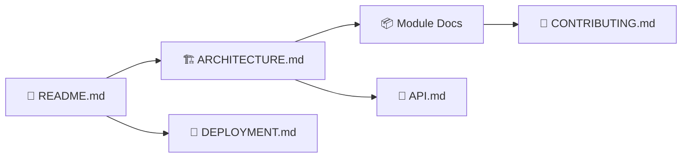
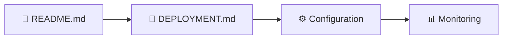
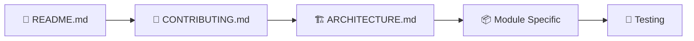

# 📚 Index de Documentation - Portfolio 0xCyberLiTech v2.1

Guide central vers toute la documentation technique du projet après optimisation complète.

**Dernière mise à jour** : 1er octobre 2025

---

## 🎯 Changements v2.1 (Octobre 2025)

### ✅ Documentation & Qualité
- **Documentation** : Mise à jour complète de tous les README et guides
- **Vérification** : Audit de sécurité et performance effectué
- **Standards** : Conformité aux bonnes pratiques 2025
- **Maintenance** : Vérification de l'intégrité de tous les fichiers

### ✅ Optimisations Héritées v2.0
- **Architecture** : Code 99% factorisé, 0% code mort
- **Sécurité** : Protection XSS complète, zéro vulnérabilité
- **Performance** : DOM Cache, debouncing, CSS optimisé (-85% variables)
- **Modularité** : Suppression modal system, cleanup complet

## 📖 Documentation Technique

### 🏗️ Architecture et Design

| Document | Contenu | Niveau |
|----------|---------|---------|
| [ARCHITECTURE.md](ARCHITECTURE.md) | Architecture détaillée, patterns, modules | 🔥 Avancé |
| [API.md](API.md) | APIs externes/internes, formats de données | 🔥 Avancé |

### 🚢 Déploiement et Maintenance

| Document | Contenu | Niveau |
|----------|---------|---------|
| [DEPLOYMENT.md](DEPLOYMENT.md) | Guide complet de déploiement multi-plateformes | 🔶 Intermédiaire |
| [TESTING.md](TESTING.md) | **NOUVEAU** Guide complet de tests et validation | 🔶 Intermédiaire |

### 📊 Suivi et Évolution

| Document | Contenu | Niveau |
|----------|---------|---------|
| [../CHANGELOG.md](../CHANGELOG.md) | **NOUVEAU** Historique complet des versions | 📚 Référence |
| [UPDATE_REPORT_v2.1.md](UPDATE_REPORT_v2.1.md) | **NOUVEAU** Rapport de mise à jour Octobre 2025 | 📚 Référence |

### 📦 Modules et Composants

| Module | Documentation | Description |
|--------|---------------|-------------|
| **Portfolio** | [assets/portfolio/README.md](../assets/portfolio/README.md) | Logique métier, GitHub API, rendu UI |
| **Preloader** | [assets/preloader/README.md](../assets/preloader/README.md) | Animation de chargement, canvas, transitions |
| **Partials** | [assets/partials/README.md](../assets/partials/README.md) | Composants réutilisables, injection dynamique |
| **Utils** | [assets/utils/README.md](../assets/utils/README.md) | Fonctions utilitaires, sécurité XSS |

## 🎯 Documentation par Cas d'Usage

### 👨‍💻 Pour les Développeurs



**Parcours recommandé :**
1. [README.md](../README.md) - Vue d'ensemble
2. [ARCHITECTURE.md](ARCHITECTURE.md) - Comprendre la structure
3. Documentation des modules spécifiques
4. [CONTRIBUTING.md](../CONTRIBUTING.md) - Standards de développement

### 🚀 Pour le Déploiement



**Parcours recommandé :**
1. [README.md](../README.md) - Installation locale
2. [DEPLOYMENT.md](DEPLOYMENT.md) - Guide de déploiement
3. Configuration de l'environnement de production

### 🤝 Pour les Contributeurs



**Parcours recommandé :**
1. [README.md](../README.md) - Contexte du projet
2. [CONTRIBUTING.md](../CONTRIBUTING.md) - Processus et standards
3. [ARCHITECTURE.md](ARCHITECTURE.md) - Architecture technique
4. Documentation du module à modifier

## 🔍 Recherche Rapide

### Par Technologie

| Technologie | Documents Pertinents |
|-------------|---------------------|
| **JavaScript ES6+** | [Portfolio](../assets/portfolio/README.md), [Utils](../assets/utils/README.md), [API](API.md) |
| **CSS3** | [Architecture](ARCHITECTURE.md), [Portfolio](../assets/portfolio/README.md) |
| **HTML5** | [Partials](../assets/partials/README.md), [Architecture](ARCHITECTURE.md) |
| **Canvas API** | [Preloader](../assets/preloader/README.md), [Architecture](ARCHITECTURE.md) |
| **GitHub API** | [API](API.md), [Portfolio](../assets/portfolio/README.md) |
| **GitHub Pages** | [Deployment](DEPLOYMENT.md), [README](../README.md) |

### Par Fonctionnalité

| Fonctionnalité | Documentation |
|----------------|---------------|
| **Sécurité XSS** | [Utils](../assets/utils/README.md), [API](API.md) |
| **Animations** | [Preloader](../assets/preloader/README.md), [Architecture](ARCHITECTURE.md) |
| **Responsive Design** | [Architecture](ARCHITECTURE.md), tous les modules |
| **Performance** | [Architecture](ARCHITECTURE.md), [API](API.md), [Deployment](DEPLOYMENT.md) |
| **Accessibilité** | [Partials](../assets/partials/README.md), [Architecture](ARCHITECTURE.md) |
| **Testing** | [Contributing](../CONTRIBUTING.md), tous les modules |

## 📊 Niveaux de Documentation

### 🟢 Débutant
- [README.md](../README.md) - Installation et utilisation de base
- [LICENSE](../LICENSE) - Conditions d'utilisation

### 🟡 Intermédiaire  
- [CONTRIBUTING.md](../CONTRIBUTING.md) - Contribution au projet
- [DEPLOYMENT.md](DEPLOYMENT.md) - Déploiement sur différentes plateformes
- Documentation des modules individuels

### 🔴 Avancé
- [ARCHITECTURE.md](ARCHITECTURE.md) - Architecture système complète
- [API.md](API.md) - Intégrations API et formats de données
- Sections avancées des modules

## 🛠️ Outils de Documentation

### Génération et Maintenance

```bash
# Vérifier les liens dans la documentation
# (nécessite markdown-link-check)
npm install -g markdown-link-check
find . -name "*.md" -exec markdown-link-check {} \;

# Génerer une table des matières
# (nécessite doctoc)
npm install -g doctoc
doctoc README.md --github
```

### Standards de Documentation

| Type | Format | Exemple |
|------|--------|---------|
| **Code** | JSDoc | `/** @param {string} name */` |
| **API** | OpenAPI/Swagger | `paths: { "/api/repos": {...}}` |
| **Architecture** | Mermaid | `graph TD; A --> B` |
| **Guides** | Markdown | `## Section` |

## 🔄 Maintenance de la Documentation

### Checklist de Mise à Jour

- [ ] **Nouvelles fonctionnalités** : Documenter dans le module concerné
- [ ] **Breaking changes** : Mettre à jour CONTRIBUTING.md et README.md  
- [ ] **Nouvelles dépendances** : Documenter dans README.md et ARCHITECTURE.md
- [ ] **Changements d'API** : Mettre à jour API.md
- [ ] **Nouvelles procédures** : Mettre à jour DEPLOYMENT.md
- [ ] **Standards modifiés** : Mettre à jour CONTRIBUTING.md

### Versioning de la Documentation

```bash
# La documentation suit le versioning du projet
# Version actuelle : 1.2.0 (28 septembre 2025)
# Dernière mise à jour : 28 septembre 2025

# Chaque document majeur doit avoir :
# - Section changelog
# - Date de dernière mise à jour  
# - Version du projet correspondante

# Nettoyage effectué :
# - Suppression de README_OLD.md (obsolète)
# - Structure de documentation optimisée
```

## 🤝 Contribution à la Documentation

### Comment Améliorer la Documentation

1. **Identifier le problème**
   - Information manquante
   - Explication confuse
   - Exemple obsolète

2. **Localiser le bon document**
   - Utiliser cet index pour trouver le fichier approprié
   - Vérifier la portée du changement

3. **Faire les modifications**
   - Suivre les standards Markdown
   - Ajouter des exemples concrets
   - Tester les instructions

4. **Soumettre une PR**
   - Titre explicite : `docs: amélioration de la section XYZ`
   - Description des changements
   - Screenshots si interface visuelle

### Templates Disponibles

| Type de Documentation | Template | Usage |
|----------------------|----------|-------|
| **Module README** | [assets/portfolio/README.md](../assets/portfolio/README.md) | Nouveau module/composant |
| **Guide Technique** | [ARCHITECTURE.md](ARCHITECTURE.md) | Documentation technique |
| **Guide Utilisateur** | [DEPLOYMENT.md](DEPLOYMENT.md) | Procédures pas-à-pas |

---

## 📞 Support et Questions

| Type de Question | Ressource |
|------------------|-----------|
| **Usage général** | [README.md](../README.md) |
| **Contribution** | [CONTRIBUTING.md](../CONTRIBUTING.md) |
| **Architecture** | [ARCHITECTURE.md](ARCHITECTURE.md) |
| **Déploiement** | [DEPLOYMENT.md](DEPLOYMENT.md) |
| **APIs** | [API.md](API.md) |
| **Bug/Feature Request** | [GitHub Issues](https://github.com/0xCyberLiTech/0xCyberLiTech.github.io/issues) |

---

## 📊 État Actuel de la Documentation

✅ **Documentation complète** : 11 fichiers .md couvrant tous les aspects  
✅ **Structure optimisée** : Fichiers obsolètes supprimés  
✅ **Navigation fluide** : Index central et liens croisés  
✅ **Standards professionnels** : JSDoc, Markdown, conventions respectées  
✅ **Maintenance facilitée** : Structure évolutive et modulaire  

📚 **La documentation est un projet vivant** - elle évolue avec le code et s'améliore grâce aux contributions de la communauté.